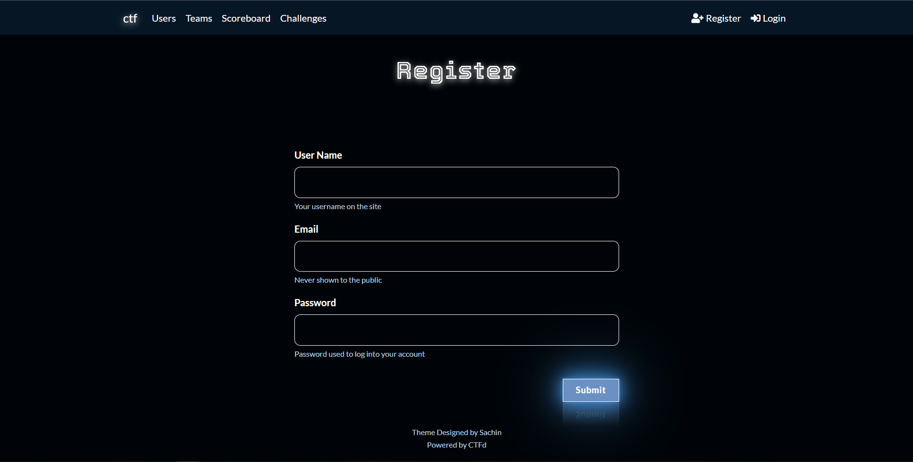
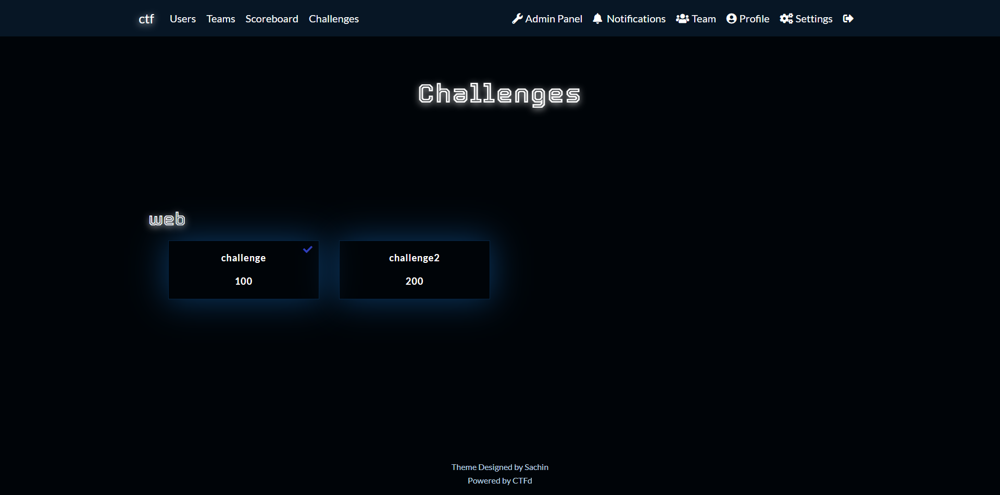
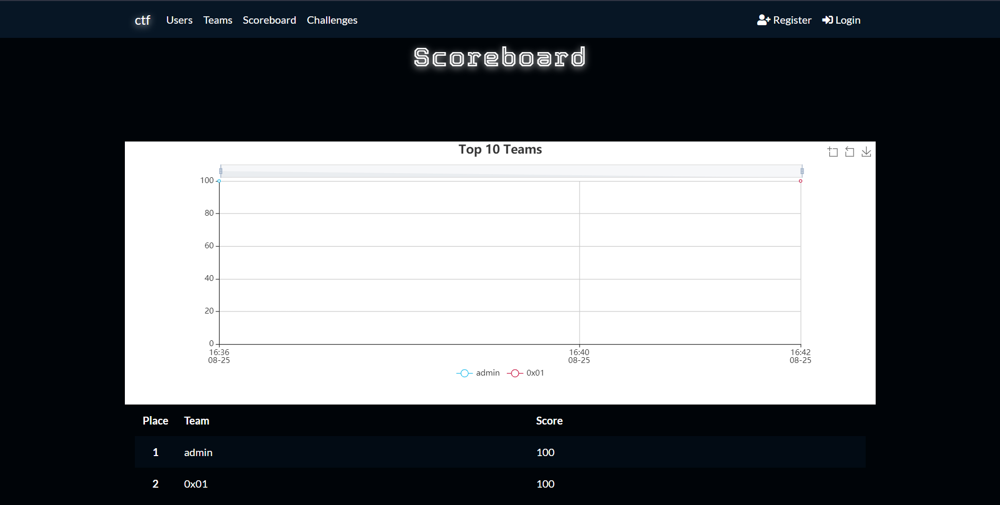

# Odin Theme
Odin theme is a Custom Dark Theme for CTFd

Here are Some Screenshots 👇:

## Index Page


## Login Page 


## Register Page


## User Page 


## Challenge Page


## Challenge Description


## ScoreBoard Page



### Installation Guide:
Open your Docker container's terminal then enter the following Command:
```
git clone https://github.com/0xdevsachin/CTFD-odin-theme.git /opt/CTFd/CTFd/themes/odin
```
Login as Admin and go to: ```Admin Panel > Config > Themes``` and switch the Theme to odin and Click on Update.

Theme is applied now refresh your CTFd and enjoy Odin theme 

If you like my work do give a star to repo 
